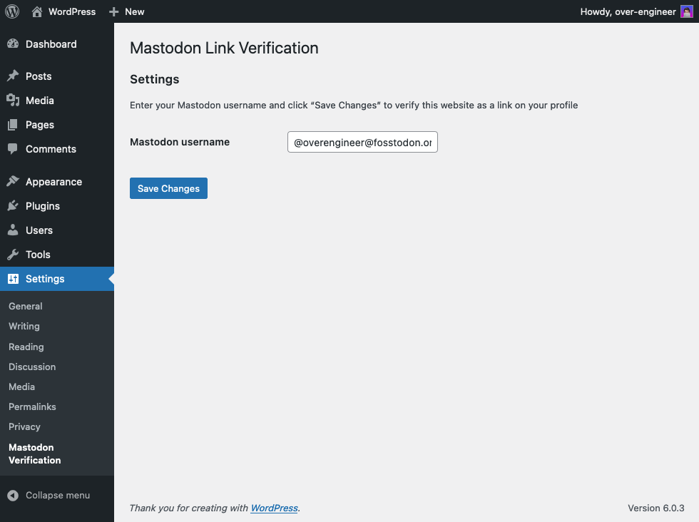

    

# Link Verification for Mastodon

<!--

-->

🐘 An unofficial WordPress plugin to quickly verify a link on your Mastodon profile.

## Table of Contents

* [Installation](#-installation)
* [Usage](#-usage)
* [Bugs & Features](#-bugs--features)
* [Credits](#-credits)
* [License](#-license)

## 📦 Installation

<!--
### Automatic installation

Automatic installation is the easiest option — WordPress will handle the file transfer,
and you won’t need to leave your web browser.

1. Log in to your WordPress dashboard
2. Navigate to the “Plugins” menu
3. Search for “Link Verification for Mastodon”
4. Click “Install Now” and WordPress will take it from there
5. Activate the plugin through the “Plugins” menu in WordPress

### Manual installation
-->

1. Upload the entire `link-verification-for-mastodon` folder to the `wp-content/plugins/` directory
2. Activate the plugin through the “Plugins” menu in WordPress

## ⌨️ Usage

After [installation and activation](#-installation):

1. In your WordPress dashboard, under “Settings”, you will find the “Mastodon Verification” menu
2. Copy-paste your **Mastodon username** (formatted as `@yourusername@your.mastodon.instance`)
3. Click “Save Changes”
4. Your link should show up as verified on your profile in a few minutes

## 🐞 Bugs & Features

If you have spotted any bugs, or would like to request additional features from the plugin,
please [file an issue](https://github.com/over-engineer/link-verification-for-mastodon/issues).

## 📙 Credits

* Plugin developed by [over-engineer](https://over-engineer.com/)
  ([`@overengineer@fosstodon.org`](https://fosstodon.org/@overengineer) on Mastodon)
* Plugin icon and banner designed by the amazing [kwnva](https://kwnva.design/)

## 📖 License

GNU GPL v2 or later, check the [`LICENSE`](./LICENSE) file.
